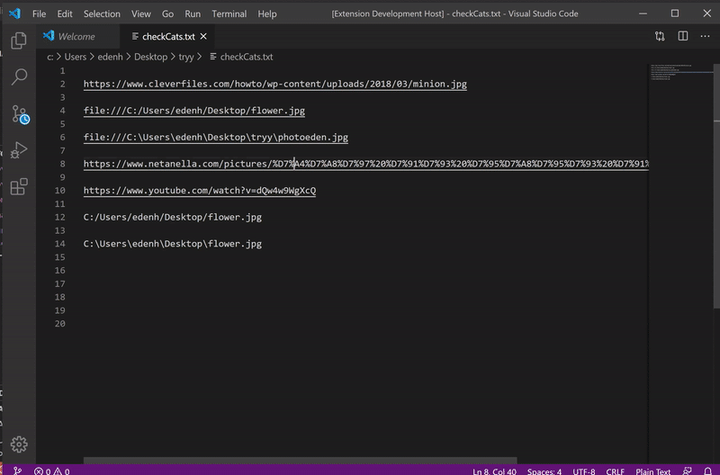
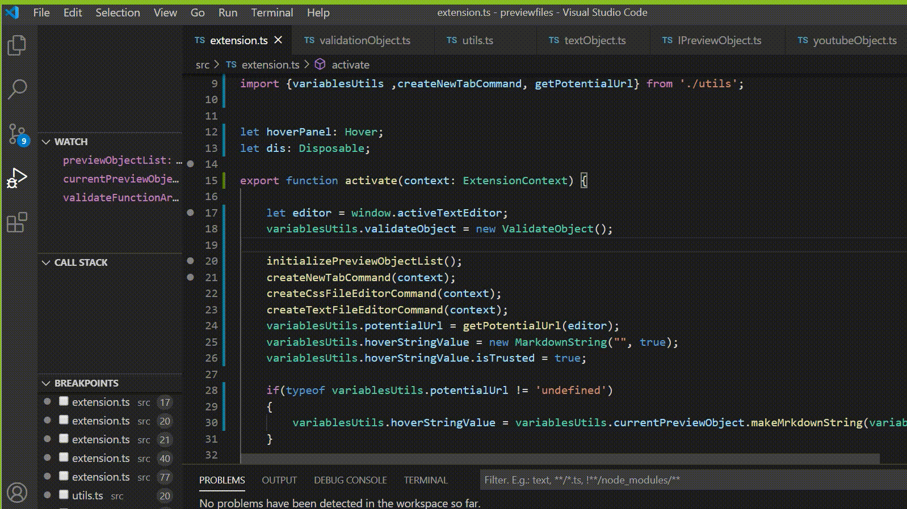

# Preview Files VSCode extention

An extension for Visual Studio Code which is currently supports a preview for YouTube videos, images, CSS, text files.

## Table of content
1. [Features](#features)
    1. [Non local images](#non-local-images)
    1. [Local images](#local-images)
    1. [YouTube videos](#youtube-videos)
    1. [CSS files](#css-files)
1. [Extention settings](#extention-settings)
1. [About us](#about-us)
1. [Known issues](#known-issues)

## Features

The extension supports the following files:

+ Non local images (URLs that begins with 'http' and ends with one of: 'png', 'jpg', 'jpeg', 'gif', 'bmp')
    * View image in a new tab inside the vscode.
    * View image in browser.
    * Image preview when hovering.

+ Local images (explicit and relative path)
    * View image in a new tab.
    * Image preview when hovering.

+ YouTube videos (youtube URLs)
    * Open video in browser.
    * Video thumbnail preview when hovering.

+ CSS files (currently only some relative paths)
    * Open Css files in a new tab (on clicking a button when hovering).

+ Text files (currently only some relative paths)
    * Open text files in a new tab (on clicking a button when hovering).

## Extension Settings

We registered some new commands (in package.json file), for example:

json
"commands": [
			{
				"command": "extension.previewHover",
				"title": "Preview Hover"
			},
			{
				"command": "previewHover.newTabCommand",
				"title": "newTabCommand"
			}
		
]

Preview Hover is called to activate the extension.

newTabCommand is only called from inside the extension whenever a new tab must be displayed.

If you want to add some new features to this project, check out [our tutorial](https://vscodeextensiondev.blogspot.com/2020/07/turorial.html)

## About us:

This is our computer science Bachelor degree final project.
We developed an extension for visual studio code that currently previews images and youtube videos.
We made our project an open source for other people to try and expand our extension to similar features (Pdf files, office file etc.)

## Known Issues

All issues and solutions are documented in [our blog](https://vscodeextensiondev.blogspot.com/)
